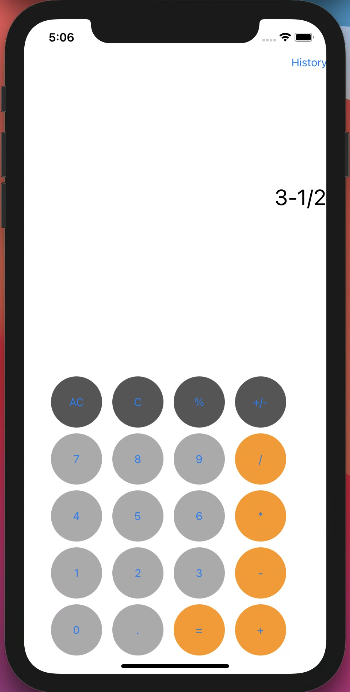
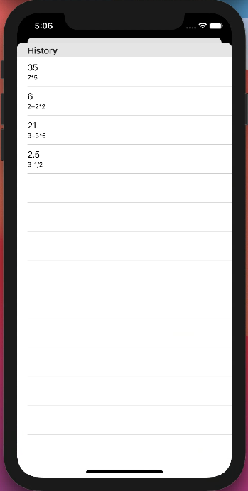

# StoryBoard-test-calc
iOS calculator built with StoryBoard (test)

## Features
### Calculation
#### Operators
* Addition (+)
* Substraction (-)
* Multiplication (*)
* Division (/)
#### Detail
* Calculation order (PEMDAS rule)
### More
* Memory calculation history
* Input answer value from history (tap)
* Input formula from history (long tap)